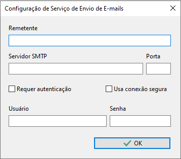
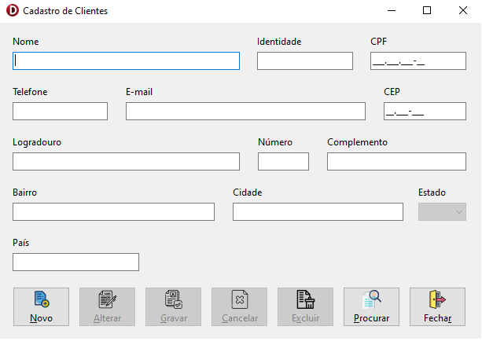
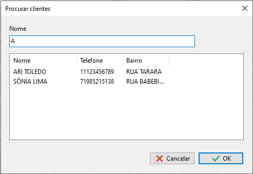

# CRUD com busca de CEPs via consumo da API https://buscacep.com.br

> Créditos para o componente de busca de CEPs, ViaCEP: –https://github.com/viniciussanchez/viacep

  
O Objetivo da Aplicação é realizar um cadastro simples de cliente sem persistência de dados (os dados são mantidos somente enquanto o sistema está em execução). Ao informar o CEP a aplicação deve consumir a API https://buscacep.com.br, retornando os dados no formato JSON e preenchendo os campos de Logradouro, Complemento, Bairro, Cidade e Estado. Ao finalizar o cadastro o sistema gera um arquivo no formato XML com os dados do cliente cadastrado e o envia para o e-mail do mesmo cliente.

### Como operar o sistema

  
- ⚡Na primeira execução do sistema, será apresentada a tela acima, nela são informados os dados para o serviço de envio de e-mail.
> - Testado com Gmail e UolHost.
> - Essas configurações são mantidas na pasta APPData do usuário, em texto claro, para uso nas próximas execuções do aplicativo. Como sugestão, seria importante implementar criptografia na gravação desses dados.

  
- ⚡Essa é a tela principal, demonstra um CRUD básico, seguindo o padrão de desenvolvimento MVP.
> - Sempre que um cliente é cadastrado, um arquivo com os dados do cadastro é gerado na pasta "AppData\InfoSistemas\". O nome do arquivo sempre será o código do cliente mais a extensão do arquivo '.xml'. **Ex: 1.xml**
> - Após ser gerado, o sistema envia automaticamente para o e-mail do cliente recém cadastrado o arquivo XML anexado.
> - Não coloquei máscara no campo de telefone devido aos diversos padrões para telefones fixos, móveis, 0800...
> - O campo "País" não está com o preenchimento automático, mas segue como sugestão de melhoria fazê-lo, já que que na combobox de Estados estão configurados de forma fixa os 27 estados brasileiros.
> - Também não coloquei uma validação para o conteudo digitado no campo de "E-mail", também fica como sugestão de melhoria.

  
 -⚡Através da tela "Procurar clientes" é possível consultar todos os registros cadastrados e abrí-los na tela principal para consulta ou edição.
